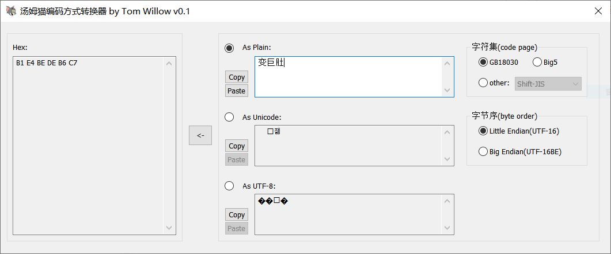

# 汤姆猫编码方式转换器 by Tom Willow v0.1

## 截图

## 功能

十六进制编码转换为 GB18030, Big5, Shift-JIS, Unicode, UTF-8 等编码。
解析 GB18030, Big5, Shift-JIS, Unicode, UTF-8 等多种编码格式的十六进制形式。
恢复各类乱码（如果乱码中出现普通问号"?"或者UTF-8的“无法识别符号”"&#65533;"，代表原文中无法编码的部分已被替换，故此部分内容无法恢复）。

## 教程

- 可以把十六进制字符串粘贴到Hex文本框内
  
> 1. 确保中间箭头指向为左到右 ->
> 2. Hex文本框内粘贴内容 CC C0 C4 B7 C3 A8 B1 E0 C2 EB B7 BD CA BD D7 AA BB BB C6 F7
> 3. “字符集”单选按钮选择“GB18030”
> 4. 此时As Plain文本框内可以看到Hex对应内容

- Shift-JIS解析为GBK乱码恢复

> 1. 确保中间箭头指向为右到左 <-
> 2. “字符集”单选按钮选择“GB18030”
> 3. As Plain文本框内粘贴内容 搶曽峠杺嫿
> 4. 为了以Hex内容为准，确保中间箭头指向为左到右 ->
> 5. “字符集”单选按钮选择“other”，下拉框选择“Shift-JIS”
> 6. 此时As Plain文本框内可以看到正确原文

Big5解析为GBK乱码恢复方式同理。在此给出题目：请恢复"变巨肚"的原文。

- UTF-8解析为GBK乱码恢复

> 1. 确保中间箭头指向为右到左 <-
> 2. “字符集”单选按钮选择“GB18030”
> 3. As Plain文本框内粘贴内容 锘挎槬鐪犱笉瑙夋檽锛屽澶勯椈鍟奸笩
> 4. 此时As UTF-8文本框内可以看到正确原文

## 运行环境

单exe文件。Windows系统。